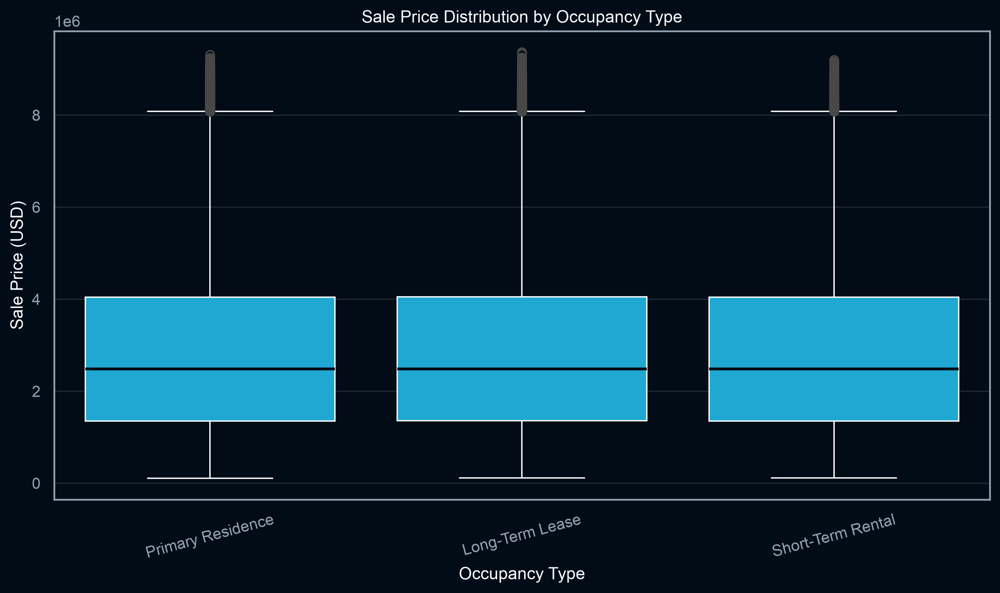
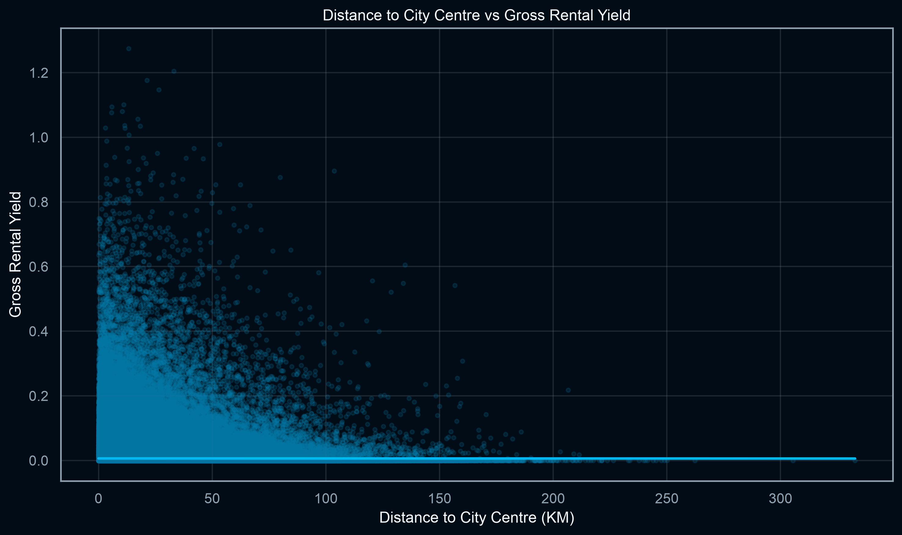
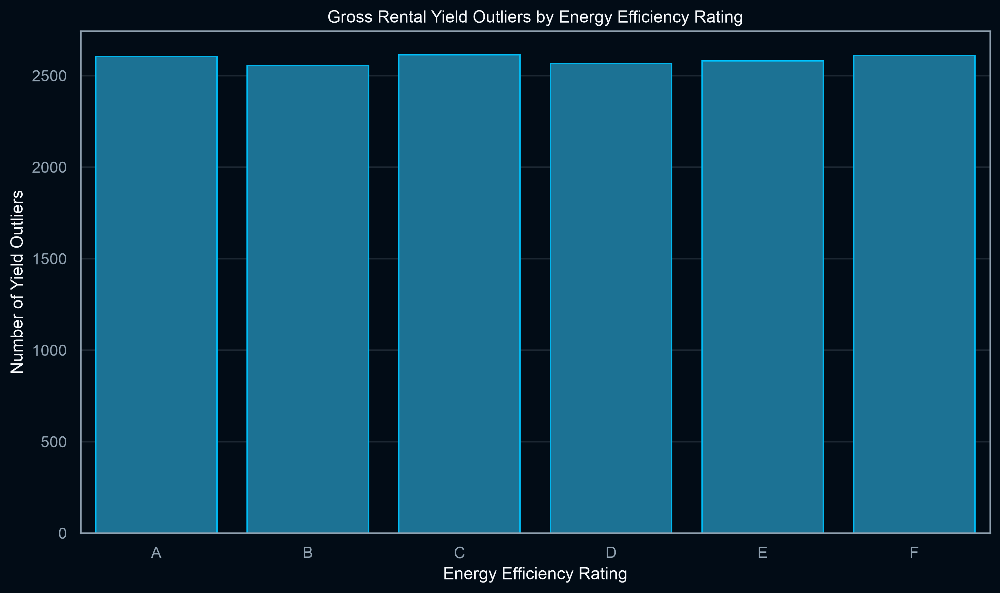
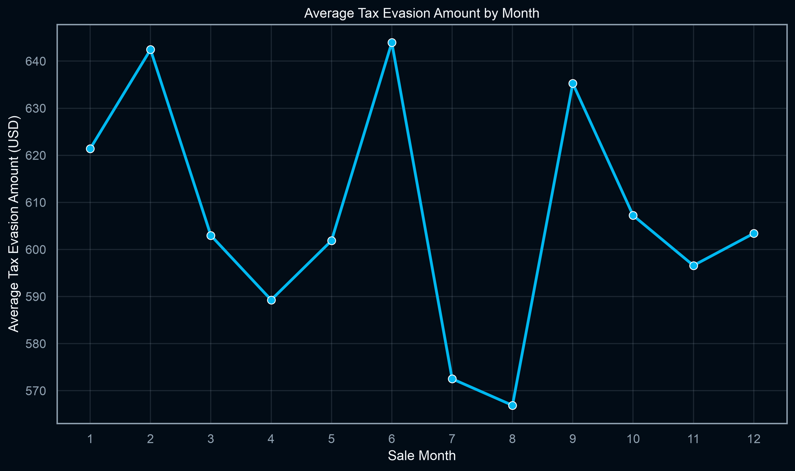
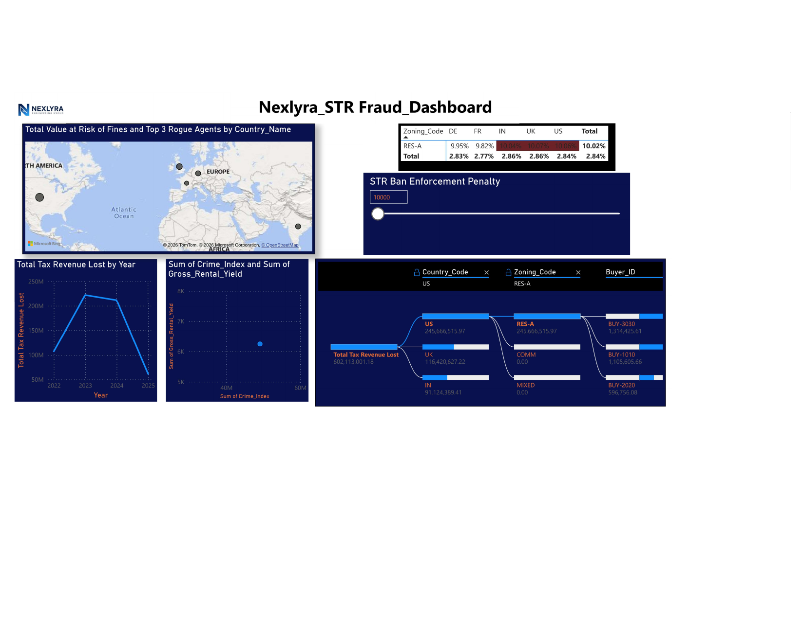

# Nexlyra REIT: Short-Term Rental Arbitrage & Zoning Fraud Audit

## Executive summary
This project audits a global real-estate portfolio for short-term-rental (STR) arbitrage and zoning-compliance risk. The analytical rule identifies STR activity in `RES-A`, the strictly residential zoning category in the model. It flags **28,184 records** and models **$602,113,001.18 in tax exposure**.

These are analytical indicators for legal, tax, and zoning review, not standalone proof of misconduct. The Welch test found no significant mean sale-price difference between flagged Ghost Hotels and Primary Residences (`t = 0.0208`, `p = 0.9833728173`); the data does not support claiming that flagged properties inflate local sale prices.

## Verified findings

| Metric | Result |
|---|---:|
| Cleaned dataset | 992,533 rows x 47 columns |
| Power BI-ready dataset | 992,533 rows x 49 columns |
| Flagged RES-A STR / Ghost Hotel records | 28,184 |
| Modeled tax exposure | $602,113,001.18 |
| Primary Residence records | 694,266 |
| Short-Term Rental records | 99,317 |
| Arbitrage-syndicate review targets | 3 buyers |
| Yield outlier queue | 15,528 observations (1.5645%) |

Priority buyer review targets: `BUY-3030`, `BUY-1010`, `BUY-2020`. Priority agent review targets: `AGT-401`, `AGT-192`, `AGT-114`. These are review queues, not findings of criminal conduct.

## Workflow
- Normalize mixed dates, timestamps, currencies, square footage, and malformed building metadata.
- Derive STR revenue, gross rental yield, price per square foot, Ghost Hotel status, and tax exposure.
- Use SQLite for STR isolation, zoning tracking, rolling yield analysis, saturation buckets, and tax views.
- Use Welch testing, anomaly screening, Pareto prioritization, and Power BI reporting.

The main SQLite table is `reit_portfolio`; reporting views include `vw_zoning_tracker` and `vw_powerbi_dataset`.

## Compliance strategy
1. Freeze new RES-A STR exposure and place flagged assets into documented legal/compliance review.
2. Preserve leases, bookings, permits, tax records, ownership, and beneficial-owner evidence.
3. Determine whether each asset can be regularized; otherwise evaluate compliant conversion or orderly divestment.
4. Report validated cases where required and implement recurring zoning, tax, buyer, and agent monitoring.

## Limitations
Ghost Hotel flags and buyer/agent rankings are derived screening indicators. Legal, tax, zoning, transaction, and source-system evidence must be independently validated before adverse action.

## Charts and dashboard evidence

### STR price comparison

### Yield and distance trend

### Zoning and seasonality evidence

### Power BI dashboard

## Repository contents
Raw and processed data, SQL architecture, Python pipeline, charts, Power BI deliverables, and supporting reports.
